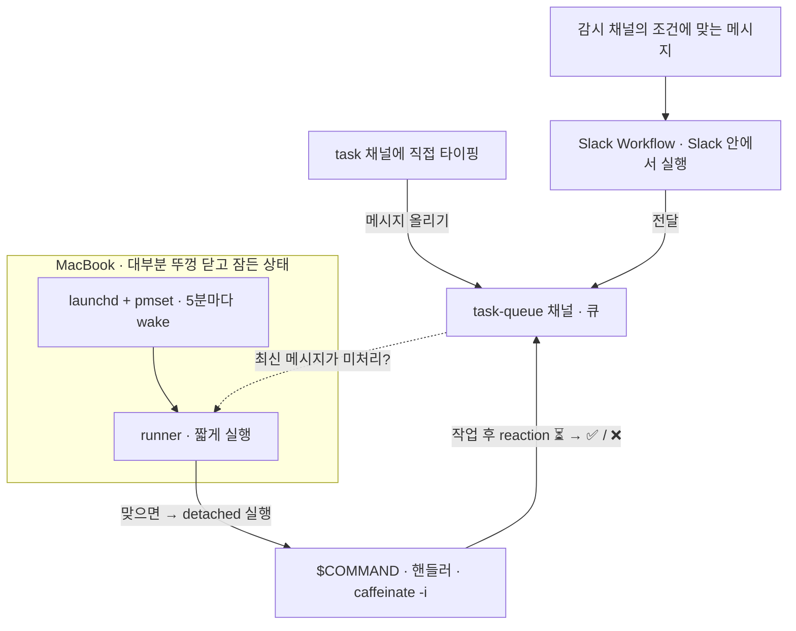

# clamshell-taskq

[English](README.md) · [한국어](README.kr.md)

[](https://github.com/Jin5823/clamshell-taskq/actions/workflows/ci.yml)
[](go.mod)
[](https://goreportcard.com/report/github.com/Jin5823/clamshell-taskq)
[](LICENSE)

**평소 뚜껑(clamshell)을 닫고 sleep 상태로 오래 두는 맥북에서, 5분마다 백그라운드 작업을 처리하기 위한 도구입니다.** 노트북이 5분마다 스스로 깨어나 Slack 채널에 쌓인 일을 가져와 명령을 실행한 뒤 다시 잠듭니다.

("Clamshell"은 Apple이 "뚜껑이 닫힌 노트북"을 부르는 용어로, 이 도구가 겨냥하는 동작 모드입니다.)

Slack 채널 자체가 큐이고, **그 채널에 메시지를 올릴 수 있는 것이라면 무엇이든 작업을 등록하는 셈**입니다 — 직접 입력하든, Slack Workflow 가 전달해 주든. `⏳` · `✅` · `❌` 세 가지 reaction이 작업의 상태를 표현합니다. 별도의 DB도 없고, **내 것이 돌아가는 곳은 노트북뿐입니다.**

- **`runner`** (유일한 바이너리, 노트북에서 실행) — `launchd` 와 `pmset` 이 5분마다 호출합니다. task 채널의 최신 메시지에 `⏳`/`✅`/`❌` reaction이 없으면 `$COMMAND` 를 백그라운드(detached)로 실행한 뒤 종료합니다.
- **Slack Workflow** (코드도, 호스트도, app-level 토큰도 없음) — 지정한 채널들을 지켜보다가 조건에 맞는 메시지를 task 채널로 전달합니다. 이것이 유입 경로의 전부입니다. 직접 띄우는 서비스 없이, 어느 채널의 작업이든 한곳으로 모입니다.



---

## 빌드

```bash
go build -o bin/runner ./cmd/runner
```

크로스 컴파일은 Go 환경변수만으로 되고, 별도 툴체인을 설치할 필요가 없습니다. 다만 runner 는 POSIX session API에 의존하므로 Unix 계열만 지원합니다.

```bash
GOOS=darwin GOARCH=arm64 go build -o bin/runner-darwin-arm64 ./cmd/runner
GOOS=linux  GOARCH=amd64 go build -o bin/runner-linux-amd64  ./cmd/runner
```

---

## Slack 앱 준비

https://api.slack.com/apps 에서 다음 순서로 설정합니다.

1. **Create New App** → from scratch
2. **OAuth & Permissions → Bot Token Scopes** 에 다음을 추가:
   - `channels:history`
   - `chat:write`
   - `reactions:write`

   *누가 무엇을 쓰나:* `channels:history` → runner, `reactions:write` + `chat:write` → `$COMMAND` 핸들러. 큐 채널을 **비공개**로 만들면 `channels:history` 대신 `groups:history` 가 필요합니다.
3. **Install to Workspace** → Bot Token 복사 → `SLACK_BOT_TOKEN` (`xoxb-` 로 시작)
4. 큐로 사용할 Slack 채널을 만듭니다 (예: `#task-queue`). 채널 ID를 복사해 `SLACK_TASK_CHANNEL` 에 넣습니다 (`C01...` 형식).
5. 봇을 **큐 채널에만** 초대합니다.

   ```
   /invite @your-bot-name
   ```

Socket Mode도, app-level 토큰도, Event Subscriptions도 필요 없습니다. 작업을 보내는 채널마다 봇을 초대할 일도 없습니다. 토큰은 노트북에만 존재합니다.

---

## 큐에 작업 넣기

"작업"은 결국 task 채널에 올라온 메시지 하나입니다. 그 채널에 메시지만 있으면 다음 runner 사이클이 미처리분을 가져가 `$COMMAND` 를 실행하며, 누가 어떻게 올렸는지는 상관없습니다. 그래서 가장 단순한 작업 등록은 그 채널에 직접 치는 것입니다.

*다른* 채널의 작업까지 모아 오려면 **Slack Workflow** 를 씁니다. Slack 안에서 돌기 때문에 살려둘 호스트도, 토큰 사본도 필요 없습니다.

Workflow Builder → **New** → **Build Workflow** 에서:

1. **Choose an event → "When a message is posted"** — 감시할 채널(최대 20개)을 고르고 키워드 조건을 추가합니다.
2. **Add Step → "Send a message"** — task 채널을 지정하고, 내용에는 메시지 텍스트 변수를 넣습니다.
3. **Finish Up → Publish** — 발행하기 전까지는 아무것도 동작하지 않습니다.

정기 작업은 트리거만 **"On a schedule"** 로 바꿔 똑같이 만들면 됩니다.

> runner 는 5분마다 깨어나므로 *처리* 주기의 하한은 5분입니다. 그 사이에 들어온 작업은 쌓였다가 다음 wake 때 한 번에 정리됩니다. 핸들러가 매 실행마다 미처리 메시지를 전부 비우기 때문입니다.

### 반드시 걸리는 네 가지

- **키워드로 @멘션을 잡을 수 없습니다.** Slack 은 실제 멘션을 `<@U0123ABC>` 형태로 저장하기 때문에, `@your-bot` 이라고 넣은 키워드는 아무것도 매칭하지 못합니다. 표시 이름은 메시지 텍스트에 아예 존재하지 않습니다. 봇을 태그하는 것으로 트리거하고 싶다면 키워드에 원시 형태인 `<@U0123ABC>` 를 그대로 넣으세요. 아니면 평범한 코드워드를 쓰면 됩니다.
- **키워드는 AND 조건입니다.** 추가한 키워드가 **모두** 들어 있어야 합니다. 지나치게 구체적인 키워드 하나가 나머지 전부를 조용히 막습니다.
- **감시 채널 목록에서 task 채널은 빼세요.** 자기가 올리는 채널을 그대로 감시하는 워크플로우는 스스로를 영원히 트리거합니다.
- **전달되는 텍스트 앞에 무언가를 붙이지 마세요.** 핸들러가 메시지에서 태그를 파싱한다면, 메시지 스텝에 하드코딩한 접두어가 사용자가 친 태그를 제치고 먼저 파싱됩니다. 변수만 단독으로 보내세요.

기본값 하나만 더 알아두면 좋습니다. **Advanced Filters 는 봇/에이전트 메시지와 스레드 답글을 기본적으로 제외합니다.** 다른 앱이 올린 글로 트리거하려면 이 필터를 조정해야 합니다.

---

## `runner` 실행 (macOS)

> Linux / Windows 가이드는 추후 추가 예정입니다.

### 1. 바이너리 설치

```bash
sudo install -m 0755 bin/runner /usr/local/bin/clamshell-runner
```

### 2. sudoers 규칙 설치

```bash
./scripts/setup-sudoers.sh
```

sudo 비밀번호를 **한 번** 묻고 `/etc/sudoers.d/clamshell-pmset` 을 설치합니다. `pmset schedule wake *` 명령만 비밀번호 없이 허용되며, 다른 `pmset` 명령은 여전히 비밀번호를 요구합니다.

### 3. 러너 파일 준비 (아직 비활성)

```bash
./scripts/setup-launchd-ready.sh
```

`~/.clamshell-taskq/` 디렉토리를 만들고, `run.sh` 래퍼와 LaunchAgent plist 를 작성합니다(먼저 runner 바이너리 설치 여부와 sudoers 규칙 동작을 점검합니다). `.env` 는 **만들지 않습니다** — 다음 단계에서 직접 복사해 넣습니다. **이 단계까지는 스케줄이 시작되지 않습니다.**

### 4. `.env` 복사

레포에서 `.env` 를 작성한 뒤 (형식은 [`.env.example`](.env.example) 참고), 러너 디렉토리로 복사합니다.

```bash
cp .env ~/.clamshell-taskq/.env
chmod 600 ~/.clamshell-taskq/.env
```

다음 세 변수가 정의되어 있어야 합니다.

```
SLACK_BOT_TOKEN=xoxb-...
SLACK_TASK_CHANNEL=C0123456789
COMMAND="/usr/bin/caffeinate -i /usr/local/bin/python3 /Users/me/handlers/main.py"
```

### 5. 스케줄 활성화

```bash
./scripts/setup-launchd-start.sh
```

LaunchAgent를 로드합니다. plist에 `RunAtLoad=true` 가 있어 launchd가 runner를 **즉시 한 번 실행**합니다. 이 실행이 다음 wake를 등록하면서 wake 체인이 시작되고, 이후로는 5분마다 자동으로 반복됩니다.

내부적으로 `run.sh` 는 사이클 전체를 `caffeinate -i` 로 감싸고, 다음 5분 지점을 전후로 `pmset` wake 를 여러 개 등록합니다(대략 -10초~+10초). 짧고 불안정한 dark wake 에서도 체인이 끊기지 않게 하기 위함입니다.

### 무엇이 어디에 설치되는지

| 경로 | 설치한 스크립트 | 용도 |
|---|---|---|
| `/etc/sudoers.d/clamshell-pmset` | `setup-sudoers.sh` | `pmset schedule wake` 와 `pmset -a disablesleep` 한정 `NOPASSWD` |
| `~/.clamshell-taskq/.env` | 사용자 (4단계, `cp`) | 본인 토큰 + `$COMMAND` |
| `~/.clamshell-taskq/run.sh` | `setup-launchd-ready.sh` | 래퍼: 사이클을 `caffeinate` → env 로드 → runner 실행 → `SleepDisabled` 유지/해제 → 다음 wake 여러 개 등록 |
| `~/Library/LaunchAgents/com.clamshell-taskq.runner.plist` | `setup-launchd-ready.sh` | `RunAtLoad` + `StartCalendarInterval` 매 5분 (`:00, :05, …, :55`) |
| `~/.clamshell-taskq/launchd.{out,err}.log` | launchd | launchd가 캡처한 runner 출력 |

### 확인

```bash
pmset -g sched                                 # 다음 wake가 잡혔는지 확인
launchctl list | grep clamshell-taskq.runner   # LaunchAgent가 등록되었는지 확인
pmset -g | grep SleepDisabled                  # 작업 중일 때만 1이어야 함
tail -f ~/.clamshell-taskq/launchd.{out,err}.log
```

### 제거

```bash
launchctl unload ~/Library/LaunchAgents/com.clamshell-taskq.runner.plist
rm ~/Library/LaunchAgents/com.clamshell-taskq.runner.plist
sudo rm /etc/sudoers.d/clamshell-pmset
sudo rm /usr/local/bin/clamshell-runner
sudo pmset schedule cancelall
sudo pmset -a disablesleep 0                   # sleep 정상 복구
# rm -rf ~/.clamshell-taskq                    # env / 로그까지 함께 지우려면 주석 해제
```

---

## 작업 중에는 깨어 있기

뚜껑을 닫은 맥은 아주 잠깐씩만 깨어납니다. runner 는 그 안에 끝나지만 대부분의 작업에는 부족합니다. 그래서 `run.sh` 는 `$COMMAND` 가 실행 중이면 커널의 `SleepDisabled` 플래그를 걸고, 실행 중인 작업이 없으면 풉니다.

```bash
pmset -g | grep SleepDisabled   # 작업 중이면 1, 아니면 0
```

매 사이클마다 다시 판단하므로 플래그가 한 사이클 넘게 남는 일은 없습니다. sudoers 규칙에 `pmset -a disablesleep` 이 들어 있는 것도 이 때문입니다.

---

## `$COMMAND` 규약

runner 는 최신 미처리 메시지 하나에 한 번 반응하고, **전체 루프는 `$COMMAND` 가 책임집니다.** 채널의 reaction이 유일한 상태이고 runner 는 언제든 다시 실행될 수 있으니, 핸들러는 **다시 돌려도 안전하게**(멱등 + 크래시 안전) 짜야 합니다. 검증된 형태는 3단계입니다.

1. **수집 — 최신에서 과거로, 처리된 메시지를 만나면 멈춤.** `conversations.history` 를 거슬러 올라가며 가져옵니다. `⏳` / `✅` / `❌` 중 하나라도 붙은 메시지를 만나면 그보다 오래된 것은 모두 처리된 것이니(FIFO 가정) 거기서 멈춥니다. 가입/탈퇴 같은 시스템 메시지는 **구체적인 `subtype` 값을 지정해서** 건너뛰고, `subtype` 이 있다는 이유만으로 건너뛰지는 마세요. Workflow 가 올린 메시지는 `subtype: "bot_message"` 를 달고 오기 때문에, 통째로 걸러 버리면 Workflow 가 전달한 작업이 전부 조용히 사라집니다.
2. **먼저 전부 `⏳` 로 선점.** 작업을 시작하기 전에, 수집한 모든 메시지에 `⏳` (`hourglass_flowing_sand`) 를 박습니다. 그러면 다음 runner 사이클이 처리됨으로 보고 다시 잡지 않습니다.
3. **오래된 것부터 처리하고, `⏳` 는 맨 마지막에 제거.** 각 메시지마다 순서대로: 작업 수행 → 결과를 thread 에 답글 → 최종 reaction 추가(성공 `✅` `white_check_mark`, 실패 `❌` `x`) → **그 다음** `⏳` 제거. 실패해도 예외를 잡아 `❌` 로 **반드시 종결**시키고, 그냥 흘려보내지 않습니다.

크래시에 안전하게 만드는 두 가지 규칙:

- **`⏳` 를 맨 마지막에 뗀다.** 최종 reaction 직후나 `⏳` 제거 직전에 프로세스가 죽어도, 메시지에는 처리됨을 뜻하는 reaction(`⏳`, 또는 `✅`/`❌`)이 남아 있어 다음 사이클이 건너뜁니다 — 중복 작업·중복 답글이 없습니다. 잠깐 `⏳`+`✅` 가 같이 보이는 건 정상입니다.
- **모든 Slack 호출을 멱등하게 만든다.** 재실행은 같은 메시지를 또 건드리므로, "이미 처리됨" 에러는 무시합니다: 추가 시 `already_reacted`, 제거 시 `no_reaction` / `message_not_found`, 답글 시 `cannot_reply_to_message` / `thread_not_found`.

그리고 큐가 수렴하게 만드는 규칙이 하나 더 있습니다.

- **runner 가 미처리로 보는 메시지를 말없이 건너뛰지 않는다.** runner 는 오직 reaction 만 봅니다. 핸들러가 reaction 을 남기지 않고 넘긴 메시지는 영원히 미처리로 남아, runner 는 5분마다 `$COMMAND` 를 계속 띄우고 핸들러는 계속 할 일이 없다고 답하는 상태가 됩니다. 처리하고 reaction 을 달든지, 그런 일이 생기지 않을 만큼 건너뛰는 조건을 좁게 유지하세요.

스케치 (Python, `slack_sdk`):

```python
RUNNING, DONE, FAILED = "hourglass_flowing_sand", "white_check_mark", "x"
HANDLED = {RUNNING, DONE, FAILED}

pending = collect_pending(client, channel)   # 최신→과거, 처리된 것 만나면 멈춤, 시스템 subtype 만 건너뜀
for msg in pending:                          # 먼저 전부 선점
    add_reaction(client, channel, msg["ts"], RUNNING)

for msg in reversed(pending):                # 오래된 것부터
    ts = msg["ts"]
    try:
        do_work(msg)
    except Exception as e:
        post_thread(client, channel, ts, f"실패: {e}")
        add_reaction(client, channel, ts, FAILED)
        remove_reaction(client, channel, ts, RUNNING)   # ⏳ 는 맨 마지막
        continue
    post_thread(client, channel, ts, "수행 완료")
    add_reaction(client, channel, ts, DONE)
    remove_reaction(client, channel, ts, RUNNING)        # ⏳ 는 맨 마지막
```

위 `add_reaction` / `remove_reaction` / `post_thread` 는 앞서 말한 "이미 처리됨" 에러를 무시하는 간단한 래퍼라, 이미 건드린 메시지를 다시 만나도 문제없이 넘어갑니다.

`launchd` 는 사용자 셸의 PATH를 물려받지 않습니다. **인터프리터와 스크립트 모두 절대경로**로 지정해 주세요. 그리고 **명령을 `caffeinate -i` 로 감싸 주세요.** `pmset` 으로 깨어난 직후 맥은 dark wake 상태이고 짧은 idle timer (보통 1분 이내) 후에는 다시 sleep 으로 돌아갑니다. `caffeinate` 가 없으면 작업 도중 macOS 가 sleep 에 들어가 명령이 중단될 수 있습니다.

```
COMMAND="/usr/bin/caffeinate -i /usr/local/bin/python3 /Users/me/handlers/main.py"
```

### 출력

| 종류 | 위치 |
|---|---|
| launchd가 캡처한 `runner` 출력 | `~/.clamshell-taskq/launchd.{out,err}.log` |
| `$COMMAND` 의 stdout / stderr | `~/.clamshell-taskq/logs/<timestamp>.log` |

---

## 라이선스

MIT — [LICENSE](LICENSE) 를 참고하세요.
