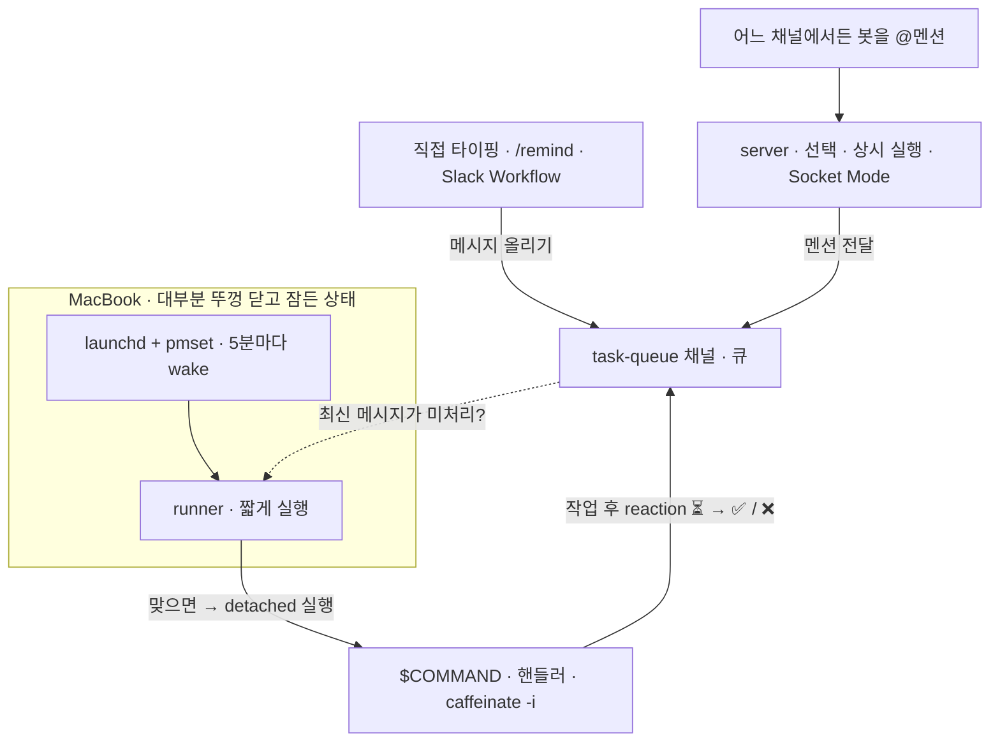

# clamshell-taskq

[English](README.md) · [한국어](README.kr.md)

[](https://github.com/Jin5823/clamshell-taskq/actions/workflows/ci.yml)
[](go.mod)
[](https://goreportcard.com/report/github.com/Jin5823/clamshell-taskq)
[](LICENSE)

**평소 뚜껑(clamshell)을 닫고 sleep 상태로 오래 두는 맥북에서, 5분마다 백그라운드 작업을 처리하기 위한 도구입니다.** 노트북이 5분마다 스스로 깨어나 Slack 채널에 쌓인 일을 가져와 명령을 실행한 뒤 다시 잠듭니다.

("Clamshell"은 Apple이 "뚜껑이 닫힌 노트북"을 부르는 용어로, 이 도구가 겨냥하는 동작 모드입니다.)

Slack 채널 자체가 큐이고, **그 채널에 메시지를 올릴 수 있는 것이라면 무엇이든 작업을 등록하는 셈**입니다 — 직접 입력이든, `/remind` 든, Slack Workflow 든, 선택 사항인 `server` 든. `⏳` · `✅` · `❌` 세 가지 reaction이 작업의 상태를 표현합니다. 별도의 DB는 없고, runner 는 그저 채널을 읽기만 합니다.

- **`runner`** (필수, 노트북에서 실행) — `launchd` 와 `pmset` 이 5분마다 호출합니다. task 채널의 최신 메시지에 `⏳`/`✅`/`❌` reaction이 없으면 `$COMMAND` 를 백그라운드(detached)로 실행한 뒤 종료합니다.
- **`server`** (선택, 상시 켜져 있는 호스트에서 실행) — 어느 채널에서든 봇을 @멘션하면 그 메시지를 곧바로 task 채널로 전달합니다. 멘션하는 순간 작업이 들어가는 셈입니다. 정기 작업(`/remind`, Workflow)만으로 충분하다면 안 써도 됩니다.



---

## 빌드

```bash
go build -o bin/server ./cmd/server
go build -o bin/runner ./cmd/runner
```

크로스 컴파일은 Go의 환경변수만으로 가능합니다. 별도 툴체인 설치가 필요하지 않습니다.

```bash
# server — 모든 OS에서 동작
GOOS=linux   GOARCH=amd64 go build -o bin/server-linux-amd64       ./cmd/server
GOOS=linux   GOARCH=arm64 go build -o bin/server-linux-arm64       ./cmd/server
GOOS=darwin  GOARCH=arm64 go build -o bin/server-darwin-arm64      ./cmd/server
GOOS=windows GOARCH=amd64 go build -o bin/server-windows-amd64.exe ./cmd/server

# runner — Unix 계열만 (POSIX session API에 의존)
GOOS=darwin GOARCH=arm64 go build -o bin/runner-darwin-arm64 ./cmd/runner
GOOS=linux  GOARCH=amd64 go build -o bin/runner-linux-amd64  ./cmd/runner
```

---

## Slack 앱 준비

https://api.slack.com/apps 에서 다음 순서로 설정합니다.

1. **Create New App** → from scratch
2. **Socket Mode** 활성화
3. **App-Level Tokens** 에서 `connections:write` 스코프로 토큰 발급 → `SLACK_APP_TOKEN` (`xapp-` 로 시작)
4. **OAuth & Permissions → Bot Token Scopes** 에 다음을 추가:
   - `app_mentions:read`
   - `chat:write`
   - `reactions:write`
   - `channels:history`

   *누가 무엇을 쓰나:* `app_mentions:read` + `chat:write` → server, `channels:history` → runner, `reactions:write` (+ thread 답글용 `chat:write`) → `$COMMAND` 핸들러. 큐 채널을 **비공개**로 만들면 `channels:history` 대신 `groups:history` 가 필요합니다.
5. **Install to Workspace** → Bot Token 복사 → `SLACK_BOT_TOKEN` (`xoxb-` 로 시작)
6. **Event Subscriptions** → `app_mention` 구독
7. 큐로 사용할 Slack 채널을 만듭니다 (예: `#task-queue`). 채널 ID를 복사해 `SLACK_TASK_CHANNEL` 에 넣습니다 (`C01...` 형식).
8. **봇을 채널에 초대합니다. 큐 채널과 멘션을 받을 채널 모두에 초대해야 합니다.**

   ```
   /invite @your-bot-name
   ```

---

## `server` 실행 (선택)

server 가 하는 일은 하나입니다 — 어느 채널에서든 봇을 @멘션하는 순간, 그 메시지를 task 채널로 전달합니다. 즉각 반응이 필요한 **리액티브** 경로입니다. 어디까지나 선택 사항이라, `/remind` 와 Slack Workflow 로 충분하면 안 써도 됩니다. runner 는 그저 채널을 읽을 뿐입니다.

상시 떠 있어야 하지만 아주 가벼운 프로세스라, 저렴한 VPS 나 무료 플랜 호스트로도 충분합니다. (나중에 서버리스 버전을 만들어 볼 수도 있습니다.)

상시 켜져 있는 호스트에 바이너리를 두고 env를 로드한 뒤 실행합니다.

```bash
cp .env.example .env
# SLACK_BOT_TOKEN, SLACK_APP_TOKEN, SLACK_TASK_CHANNEL 을 채웁니다.

set -a; source .env; set +a
./bin/server
```

Socket Mode로 outbound WebSocket을 유지하기 때문에 inbound 포트나 공개 URL이 필요하지 않습니다.

---

## `runner` 실행 (macOS)

> Linux / Windows 가이드는 추후 추가 예정입니다.

### 1. 바이너리 설치

```bash
sudo install -m 0755 bin/runner /usr/local/bin/clamshell-runner
```

### 2. sudoers 규칙 설치

```bash
./scripts/setup-sudoers.sh
```

sudo 비밀번호를 **한 번** 묻고 `/etc/sudoers.d/clamshell-pmset` 을 설치합니다. `pmset schedule wake *` 명령만 비밀번호 없이 허용되며, 다른 `pmset` 명령은 여전히 비밀번호를 요구합니다.

### 3. 러너 파일 준비 (아직 비활성)

```bash
./scripts/setup-launchd-ready.sh
```

`~/.clamshell-taskq/` 디렉토리를 만들고, `run.sh` 래퍼와 LaunchAgent plist 를 작성합니다(먼저 runner 바이너리 설치 여부와 sudoers 규칙 동작을 점검합니다). `.env` 는 **만들지 않습니다** — 다음 단계에서 직접 복사해 넣습니다. **이 단계까지는 스케줄이 시작되지 않습니다.**

### 4. `.env` 복사

레포에서 `.env` 를 작성한 뒤 (형식은 [`.env.example`](.env.example) 참고), 러너 디렉토리로 복사합니다.

```bash
cp .env ~/.clamshell-taskq/.env
chmod 600 ~/.clamshell-taskq/.env
```

다음 세 변수가 정의되어 있어야 합니다.

```
SLACK_BOT_TOKEN=xoxb-...
SLACK_TASK_CHANNEL=C0123456789
COMMAND="/usr/bin/caffeinate -i /usr/local/bin/python3 /Users/me/handlers/main.py"
```

### 5. 스케줄 활성화

```bash
./scripts/setup-launchd-start.sh
```

LaunchAgent를 로드합니다. plist에 `RunAtLoad=true` 가 있어 launchd가 runner를 **즉시 한 번 실행**합니다. 이 실행이 다음 wake를 등록하면서 wake 체인이 시작되고, 이후로는 5분마다 자동으로 반복됩니다.

내부적으로 `run.sh` 는 사이클 전체를 `caffeinate -i` 로 감싸고, 다음 5분 지점을 전후로 `pmset` wake 를 여러 개 등록합니다(대략 -10초~+10초). 짧고 불안정한 dark wake 에서도 체인이 끊기지 않게 하기 위함입니다.

### 무엇이 어디에 설치되는지

| 경로 | 설치한 스크립트 | 용도 |
|---|---|---|
| `/etc/sudoers.d/clamshell-pmset` | `setup-sudoers.sh` | `pmset schedule wake *` 한정 `NOPASSWD` |
| `~/.clamshell-taskq/.env` | 사용자 (4단계, `cp`) | 본인 토큰 + `$COMMAND` |
| `~/.clamshell-taskq/run.sh` | `setup-launchd-ready.sh` | 래퍼: 사이클을 `caffeinate` → env 로드 → runner 실행 → 다음 wake 여러 개 등록 |
| `~/Library/LaunchAgents/com.clamshell-taskq.runner.plist` | `setup-launchd-ready.sh` | `RunAtLoad` + `StartCalendarInterval` 매 5분 (`:00, :05, …, :55`) |
| `~/.clamshell-taskq/launchd.{out,err}.log` | launchd | launchd가 캡처한 runner 출력 |

### 확인

```bash
pmset -g sched                                 # 다음 wake가 잡혔는지 확인
launchctl list | grep clamshell-taskq.runner   # LaunchAgent가 등록되었는지 확인
tail -f ~/.clamshell-taskq/launchd.{out,err}.log
```

### 제거

```bash
launchctl unload ~/Library/LaunchAgents/com.clamshell-taskq.runner.plist
rm ~/Library/LaunchAgents/com.clamshell-taskq.runner.plist
sudo rm /etc/sudoers.d/clamshell-pmset
sudo rm /usr/local/bin/clamshell-runner
sudo pmset schedule cancelall
# rm -rf ~/.clamshell-taskq                    # env / 로그까지 함께 지우려면 주석 해제
```

---

## 작업 넣기

"작업"은 결국 task 채널에 올라온 메시지 하나입니다. 누가 어떻게 올렸든 그 채널에 메시지만 있으면, 다음 runner 사이클이 그걸 가져와 `$COMMAND` 를 실행합니다. 이 채널이 곧 인터페이스의 전부입니다.

일의 성격에 따라 두 갈래입니다.

- **정기 / 반복 — 직접 띄워둘 게 없음.** Slack 이 알아서 정해진 시각에 task 채널로 메시지를 올립니다(아래 표). 대부분은 이 경우입니다.
- **즉각 / 리액티브 — 선택 사항인 [`server`](#server-실행-선택).** 어느 채널에서든 봇을 @멘션하면 즉시 task 채널로 전달됩니다. 즉시성이 필요할 때만 쓰면 됩니다.

### 반복 작업 예약하기

Slack 에는 정해진 시각에 메시지를 보내는 기능이 이미 있습니다. 그걸 cron 처럼 쓰면 됩니다. 필요한 주기에 맞는 도구를 고르세요.

| 주기 | 도구 | 방법 |
|---|---|---|
| 매일 / 매주, 정해진 시각 | `/remind` | task 채널에서 `/remind` 를 실행하면 바로 큐에 들어갑니다 — 예: `/remind here to "확인 부탁드립니다" every day at 9am`. (다른 채널에서 `@your-bot` 멘션과 함께 실행하면 선택 사항인 server 가 대신 전달합니다.) |
| 시간 단위 | **Slack Workflow** | `/remind` 는 하루보다 잦게 반복할 수 없습니다. Workflow(Workflow Builder → *Scheduled* 트리거)를 만들고, task 채널에 작업 메시지를 올리는 단계를 추가하세요. |
| 분 단위 | **직접 띄운 server / cron** | Slack 기본 스케줄러는 그렇게까지 잘게 내려가지 않습니다. 상시 실행되는 작은 프로세스를 두고, 분 단위 cron 으로 task 채널에 메시지를 올립니다. |

> runner 는 5분마다 깨어나므로 *처리* 주기의 하한은 5분입니다. 분 단위로 넣은 작업은 쌓였다가 다음 wake 때 한 번에 처리됩니다(핸들러가 매 실행마다 미처리 메시지를 모두 비웁니다).

**Workflow 는 스케줄에만 쓰는 게 아닙니다.** Slack Workflow 는 *이벤트* 로도 실행됩니다 — 어떤 채널에 특정 메시지가 올라오거나, 이모지 reaction 이 달리거나, 폼이 제출되면 — 그에 반응해 task 채널로 메시지를 올릴 수 있습니다. 직접 서버를 띄우지 않고도 리액티브하게 작업을 넣는 방법입니다.

---

## `$COMMAND` 규약

runner 는 최신 미처리 메시지 하나에 한 번 반응하고, **전체 루프는 `$COMMAND` 가 책임집니다.** 채널의 reaction이 유일한 상태이고 runner 는 언제든 다시 실행될 수 있으니, 핸들러는 **다시 돌려도 안전하게**(멱등 + 크래시 안전) 짜야 합니다. 검증된 형태는 3단계입니다.

1. **수집 — 최신에서 과거로, 처리된 메시지를 만나면 멈춤.** `conversations.history` 를 거슬러 올라가며 가져옵니다. `⏳` / `✅` / `❌` 중 하나라도 붙은 메시지를 만나면 그보다 오래된 것은 모두 처리된 것이니(FIFO 가정) 거기서 멈춥니다. 시스템 메시지(`subtype` 이 있는 것)는 건너뜁니다.
2. **먼저 전부 `⏳` 로 선점.** 작업을 시작하기 전에, 수집한 모든 메시지에 `⏳` (`hourglass_flowing_sand`) 를 박습니다. 그러면 다음 runner 사이클이 처리됨으로 보고 다시 잡지 않습니다.
3. **오래된 것부터 처리하고, `⏳` 는 맨 마지막에 제거.** 각 메시지마다 순서대로: 작업 수행 → 결과를 thread 에 답글 → 최종 reaction 추가(성공 `✅` `white_check_mark`, 실패 `❌` `x`) → **그 다음** `⏳` 제거. 실패해도 예외를 잡아 `❌` 로 **반드시 종결**시키고, 그냥 흘려보내지 않습니다.

크래시에 안전하게 만드는 두 가지 규칙:

- **`⏳` 를 맨 마지막에 뗀다.** 최종 reaction 직후나 `⏳` 제거 직전에 프로세스가 죽어도, 메시지에는 처리됨을 뜻하는 reaction(`⏳`, 또는 `✅`/`❌`)이 남아 있어 다음 사이클이 건너뜁니다 — 중복 작업·중복 답글이 없습니다. 잠깐 `⏳`+`✅` 가 같이 보이는 건 정상입니다.
- **모든 Slack 호출을 멱등하게 만든다.** 재실행은 같은 메시지를 또 건드리므로, "이미 처리됨" 에러는 무시합니다: 추가 시 `already_reacted`, 제거 시 `no_reaction` / `message_not_found`, 답글 시 `cannot_reply_to_message` / `thread_not_found`.

스케치 (Python, `slack_sdk`):

```python
RUNNING, DONE, FAILED = "hourglass_flowing_sand", "white_check_mark", "x"
HANDLED = {RUNNING, DONE, FAILED}

pending = collect_pending(client, channel)   # 최신→과거, 처리된 것 만나면 멈춤, subtype 건너뜀
for msg in pending:                          # 먼저 전부 선점
    add_reaction(client, channel, msg["ts"], RUNNING)

for msg in reversed(pending):                # 오래된 것부터
    ts = msg["ts"]
    try:
        do_work(msg)
    except Exception as e:
        post_thread(client, channel, ts, f"실패: {e}")
        add_reaction(client, channel, ts, FAILED)
        remove_reaction(client, channel, ts, RUNNING)   # ⏳ 는 맨 마지막
        continue
    post_thread(client, channel, ts, "수행 완료")
    add_reaction(client, channel, ts, DONE)
    remove_reaction(client, channel, ts, RUNNING)        # ⏳ 는 맨 마지막
```

위 `add_reaction` / `remove_reaction` / `post_thread` 는 앞서 말한 "이미 처리됨" 에러를 무시하는 간단한 래퍼라, 이미 건드린 메시지를 다시 만나도 문제없이 넘어갑니다.

`launchd` 는 사용자 셸의 PATH를 물려받지 않습니다. **인터프리터와 스크립트 모두 절대경로**로 지정해 주세요. 그리고 **명령을 `caffeinate -i` 로 감싸 주세요.** `pmset` 으로 깨어난 직후 맥은 dark wake 상태이고 짧은 idle timer (보통 1분 이내) 후에는 다시 sleep 으로 돌아갑니다. `caffeinate` 가 없으면 작업 도중 macOS 가 sleep 에 들어가 명령이 중단될 수 있습니다.

```
COMMAND="/usr/bin/caffeinate -i /usr/local/bin/python3 /Users/me/handlers/main.py"
```

### 출력

| 종류 | 위치 |
|---|---|
| launchd가 캡처한 `runner` 출력 | `~/.clamshell-taskq/launchd.{out,err}.log` |
| `$COMMAND` 의 stdout / stderr | `~/.clamshell-taskq/logs/<timestamp>.log` |

---

## 솔직한 한계

- **macOS 자체가 모든 wake를 보장하지는 않습니다.** 뚜껑 닫힘 + 배터리 + 깊은 sleep 조합에서는 가끔 wake 사이클 하나가 통째로 빠질 수 있습니다. 대부분의 5분 사이클은 정상 동작합니다.
- 빠진 wake가 곧 작업 손실로 이어지지 않습니다. Slack 채널이 큐 역할을 하므로, 다음에 깨어났을 때 그동안 쌓인 작업을 모두 처리합니다.

## 라이선스

MIT — [LICENSE](LICENSE) 를 참고하세요.
