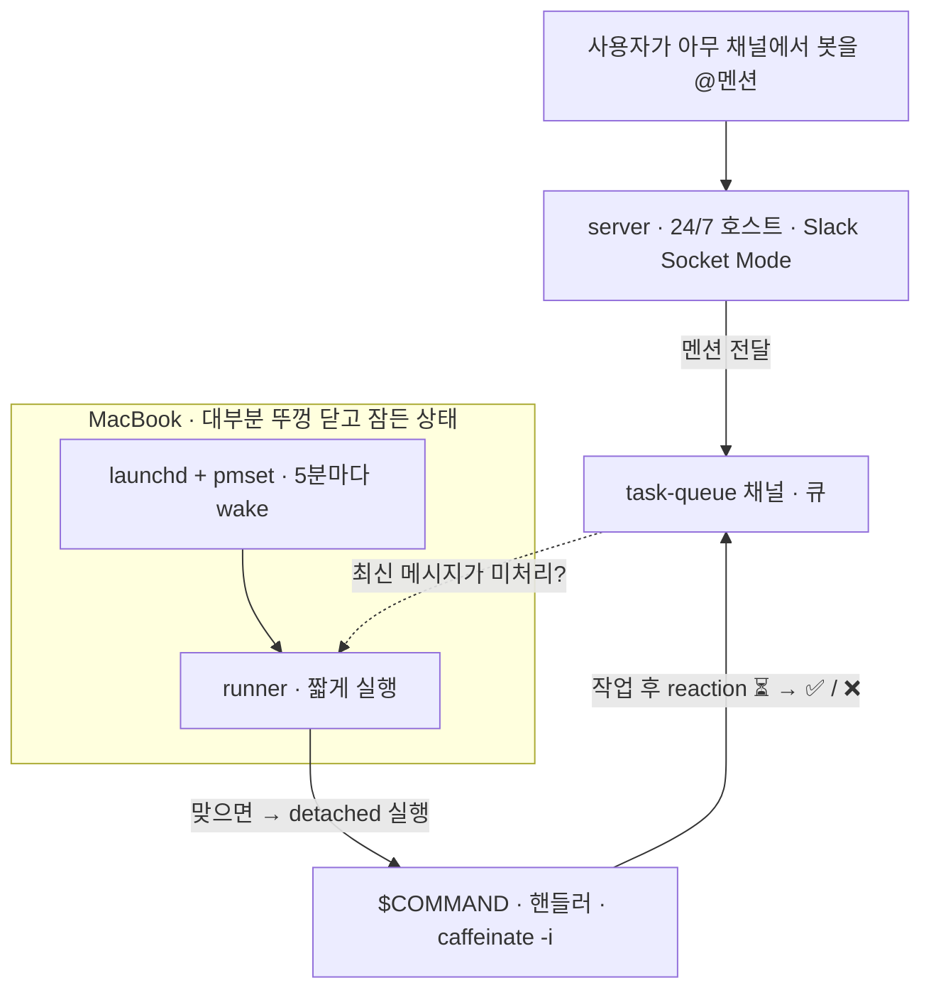

# clamshell-taskq

[English](README.md) · [한국어](README.kr.md)

[](https://github.com/Jin5823/clamshell-taskq/actions/workflows/ci.yml)
[](go.mod)
[](https://goreportcard.com/report/github.com/Jin5823/clamshell-taskq)
[](LICENSE)

**뚜껑(clamshell)을 닫고 sleep 상태로 두는 시간이 긴 맥북에서, 5분마다 백그라운드 작업을 처리하기 위한 도구입니다.** 노트북이 5분마다 스스로 깨어나 Slack 채널에 쌓인 일을 가져와 명령을 실행한 뒤 다시 잠듭니다.

("Clamshell"은 Apple이 "뚜껑이 닫힌 노트북"을 부르는 용어로, 이 도구가 설계 대상으로 삼는 동작 모드입니다.)

- **`server`** — 24/7 호스트에서 상시 실행됩니다. Slack 멘션을 받아 하나의 "task 채널"에 옮겨 담습니다.
- **`runner`** — 노트북에서 짧게 실행되고 곧바로 종료됩니다. `launchd` 와 `pmset` 이 협업해 5분마다 호출합니다. task 채널의 최신 메시지에 reaction이 없으면 `$COMMAND` 를 백그라운드(detached)로 실행한 뒤 종료합니다.

Slack 채널 자체가 큐입니다. `⏳` · `✅` · `❌` 세 가지 reaction이 작업의 상태를 표현합니다. 별도의 DB나 `server` ↔ `runner` 간 HTTP 통신은 없습니다.



---

## 빌드

```bash
go build -o bin/server ./cmd/server
go build -o bin/runner ./cmd/runner
```

크로스 컴파일은 Go의 환경변수만으로 가능합니다. 별도 툴체인 설치가 필요하지 않습니다.

```bash
# server — 모든 OS에서 동작
GOOS=linux   GOARCH=amd64 go build -o bin/server-linux-amd64       ./cmd/server
GOOS=linux   GOARCH=arm64 go build -o bin/server-linux-arm64       ./cmd/server
GOOS=darwin  GOARCH=arm64 go build -o bin/server-darwin-arm64      ./cmd/server
GOOS=windows GOARCH=amd64 go build -o bin/server-windows-amd64.exe ./cmd/server

# runner — Unix 계열만 (POSIX session API에 의존)
GOOS=darwin GOARCH=arm64 go build -o bin/runner-darwin-arm64 ./cmd/runner
GOOS=linux  GOARCH=amd64 go build -o bin/runner-linux-amd64  ./cmd/runner
```

---

## Slack 앱 준비

https://api.slack.com/apps 에서 다음 순서로 설정합니다.

1. **Create New App** → from scratch
2. **Socket Mode** 활성화
3. **App-Level Tokens** 에서 `connections:write` 스코프로 토큰 발급 → `SLACK_APP_TOKEN` (`xapp-` 로 시작)
4. **OAuth & Permissions → Bot Token Scopes** 에 다음을 추가:
   - `app_mentions:read`
   - `chat:write`
   - `reactions:write`
   - `channels:history`
5. **Install to Workspace** → Bot Token 복사 → `SLACK_BOT_TOKEN` (`xoxb-` 로 시작)
6. **Event Subscriptions** → `app_mention` 구독
7. 큐로 사용할 Slack 채널을 만듭니다 (예: `#task-queue`). 채널 ID를 복사해 `SLACK_TASK_CHANNEL` 에 넣습니다 (`C01...` 형식).
8. **봇을 채널에 초대합니다. 큐 채널과 멘션을 받을 채널 모두에 초대해야 합니다.**

   ```
   /invite @your-bot-name
   ```

---

## `server` 실행 (24/7 호스트)

24/7 호스트에 바이너리를 두고 env를 로드한 뒤 실행합니다.

```bash
cp .env.example .env
# SLACK_BOT_TOKEN, SLACK_APP_TOKEN, SLACK_TASK_CHANNEL 을 채웁니다.

set -a; source .env; set +a
./bin/server
```

Socket Mode로 outbound WebSocket을 유지하기 때문에 inbound 포트나 공개 URL이 필요하지 않습니다.

---

## `runner` 실행 (macOS)

> Linux / Windows 가이드는 추후 추가 예정입니다.

### 1. 바이너리 설치

```bash
sudo install -m 0755 bin/runner /usr/local/bin/clamshell-runner
```

### 2. sudoers 규칙 설치

```bash
./scripts/setup-sudoers.sh
```

sudo 비밀번호를 **한 번** 묻고 `/etc/sudoers.d/clamshell-pmset` 을 설치합니다. `pmset schedule wake *` 명령만 비밀번호 없이 허용되며, 다른 `pmset` 명령은 여전히 비밀번호를 요구합니다.

### 3. 러너 파일 준비 (아직 비활성)

```bash
./scripts/setup-launchd-ready.sh
```

`~/.clamshell-taskq/` 디렉토리, `.env` placeholder, `run.sh` 래퍼, LaunchAgent plist를 작성합니다. **이 단계까지는 스케줄이 시작되지 않습니다.**

### 4. `.env` 복사

레포에서 `.env` 를 작성한 뒤 (형식은 [`.env.example`](.env.example) 참고), 러너 디렉토리로 복사합니다.

```bash
cp .env ~/.clamshell-taskq/.env
chmod 600 ~/.clamshell-taskq/.env
```

다음 세 변수가 정의되어 있어야 합니다.

```
SLACK_BOT_TOKEN=xoxb-...
SLACK_TASK_CHANNEL=C0123456789
COMMAND="/usr/local/bin/python3 /Users/me/handlers/main.py"
```

### 5. 스케줄 활성화

```bash
./scripts/setup-launchd-start.sh
```

LaunchAgent를 로드합니다. plist에 `RunAtLoad=true` 가 있어 launchd가 runner를 **즉시 한 번 실행**합니다. 이 실행이 다음 wake를 등록하면서 wake 체인이 시작되고, 이후로는 5분마다 자동으로 반복됩니다.

### 무엇이 어디에 설치되는지

| 경로 | 설치한 스크립트 | 용도 |
|---|---|---|
| `/etc/sudoers.d/clamshell-pmset` | `setup-sudoers.sh` | `pmset schedule wake *` 한정 `NOPASSWD` |
| `~/.clamshell-taskq/.env` | `setup-launchd-ready.sh` | 본인 토큰 + `$COMMAND` |
| `~/.clamshell-taskq/run.sh` | `setup-launchd-ready.sh` | 래퍼: env 로드 → runner 실행 → 다음 wake 등록 |
| `~/Library/LaunchAgents/com.clamshell-taskq.runner.plist` | `setup-launchd-ready.sh` | `RunAtLoad` + `StartCalendarInterval` 매 5분 (`:00, :05, …, :55`) |
| `~/.clamshell-taskq/launchd.{out,err}.log` | launchd | launchd가 캡처한 runner 출력 |

### 확인

```bash
pmset -g sched                                 # 다음 wake가 잡혔는지 확인
launchctl list | grep clamshell-taskq.runner   # LaunchAgent가 등록되었는지 확인
tail -f ~/.clamshell-taskq/launchd.{out,err}.log
```

### 제거

```bash
launchctl unload ~/Library/LaunchAgents/com.clamshell-taskq.runner.plist
rm ~/Library/LaunchAgents/com.clamshell-taskq.runner.plist
sudo rm /etc/sudoers.d/clamshell-pmset
sudo pmset schedule cancelall
# rm -rf ~/.clamshell-taskq                    # env / 로그까지 함께 지우려면 주석 해제
```

---

## `$COMMAND` 규약

`runner` 는 큐의 최신 메시지 하나만 보고 `$COMMAND` 를 한 번 호출합니다. 그 호출 안에서 **전체 처리 루프를 책임지는 쪽은 `$COMMAND`** 입니다.

1. **미처리 메시지를 모두 가져옵니다.** `conversations.history` 페이지네이션을 사용합니다. "미처리"는 `⏳` · `✅` · `❌` reaction이 모두 없는 메시지를 의미합니다.
2. **각 메시지를 순서대로 처리합니다.**
   - 작업 시작 전에 `⏳` (`hourglass_flowing_sand`) 를 먼저 박습니다. 다음 사이클의 `runner` 가 같은 메시지를 다시 잡지 않게 하기 위함입니다.
   - 실제 작업을 수행합니다.
   - 성공 시 `✅` (`white_check_mark`) 를 추가합니다.
   - 실패 시 `❌` (`x`) 를 추가하고, 선택적으로 thread에 에러 메시지를 reply 합니다.

`launchd` 는 사용자 셸의 PATH를 물려받지 않습니다. **인터프리터와 스크립트 모두 절대경로**로 지정해 주세요. 그리고 **명령을 `caffeinate -i` 로 감쌉니다.** `pmset` 으로 깨어난 직후 맥은 dark wake 상태이고 짧은 idle timer (보통 1분 이내) 후에는 다시 sleep 으로 돌아갑니다. `caffeinate` 가 없으면 작업 도중 macOS 가 sleep 에 들어가 명령이 중단될 수 있습니다.

```
COMMAND="/usr/bin/caffeinate -i /usr/local/bin/python3 /Users/me/handlers/main.py"
```

### 출력

| 종류 | 위치 |
|---|---|
| launchd가 캡처한 `runner` 출력 | `~/.clamshell-taskq/launchd.{out,err}.log` |
| `$COMMAND` 의 stdout / stderr | `~/.clamshell-taskq/logs/<timestamp>.log` |

---

## 솔직한 한계

- **macOS 자체가 모든 wake를 보장하지는 않습니다.** lid 닫힘 + 배터리 + 깊은 sleep 조합에서 가끔 wake 한 사이클이 빠질 수 있습니다. 대부분의 5분 사이클은 정상 동작합니다.
- 빠진 wake가 곧 작업 손실로 이어지지 않습니다. Slack 채널이 큐 역할을 하므로, 다음에 깨어났을 때 그동안 쌓인 작업을 모두 처리합니다.

## 라이선스

MIT — [LICENSE](LICENSE) 를 참고하세요.
