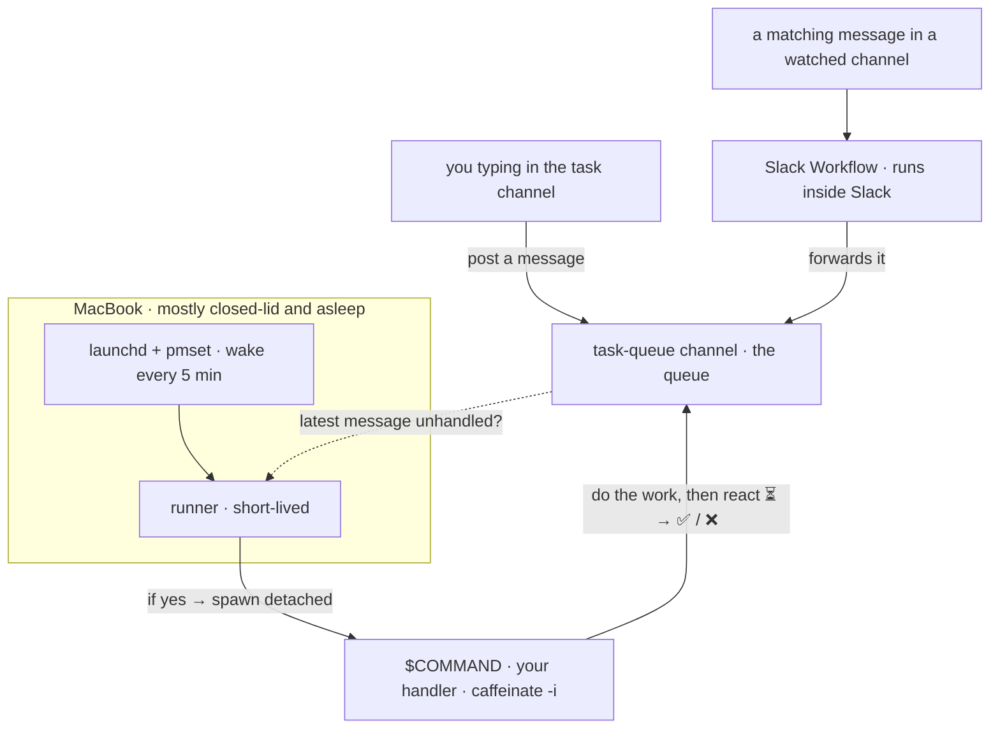

# clamshell-taskq

[English](README.md) · [한국어](README.kr.md)

[](https://github.com/Jin5823/clamshell-taskq/actions/workflows/ci.yml)
[](go.mod)
[](https://goreportcard.com/report/github.com/Jin5823/clamshell-taskq)
[](LICENSE)

**Run background tasks on a MacBook that's mostly closed and asleep.** The laptop wakes itself every 5 minutes, picks up pending work from a Slack channel, runs your command, and goes back to sleep.

("Clamshell" is Apple's term for "laptop with the lid closed" — the mode this tool is built around.)

The Slack channel itself is the queue, and **anything that can post to it enqueues work** — you typing a message, or a Slack Workflow forwarding one in. Reactions (`⏳`/`✅`/`❌`) are the state. No database, and **nothing of yours runs anywhere but the laptop**.

- **`runner`** (the only binary, on your laptop) — invoked every 5 minutes by `launchd` + `pmset` wake. If the latest task-channel message carries no `⏳`/`✅`/`❌` reaction yet, it spawns `$COMMAND` detached and exits.
- **A Slack Workflow** (no code, no host, no app-level token) — watches the channels you pick and forwards matching messages into the task channel. That is the entire ingest path: work fans in from anywhere into one channel, with no service of yours to run.



---

## Build

```bash
go build -o bin/runner ./cmd/runner
```

Cross-compile with env vars alone — no toolchain to install. The runner is Unix-only, since it relies on POSIX session APIs:

```bash
GOOS=darwin GOARCH=arm64 go build -o bin/runner-darwin-arm64 ./cmd/runner
GOOS=linux  GOARCH=amd64 go build -o bin/runner-linux-amd64  ./cmd/runner
```

---

## Slack app

At https://api.slack.com/apps:

1. **Create New App** → from scratch.
2. **OAuth & Permissions → Bot Token Scopes**:
   - `channels:history`
   - `chat:write`
   - `reactions:write`

   *Who uses what:* `channels:history` → the runner; `reactions:write` + `chat:write` → your `$COMMAND` handler. If your queue channel is **private**, use `groups:history` instead of `channels:history`.
3. **Install to Workspace** → copy Bot Token → `SLACK_BOT_TOKEN` (`xoxb-...`).
4. Create a channel that will act as the queue (e.g. `#task-queue`). Copy its ID → `SLACK_TASK_CHANNEL` (`C0123...`).
5. Invite the bot into the task channel — and **only** the task channel:

   ```
   /invite @your-bot-name
   ```

No Socket Mode, no app-level token, no Event Subscriptions, and the bot never needs to join the channels you send work from. The token lives on your laptop and nowhere else.

---

## Getting work into the queue

A "task" is just a message in the task channel. The next runner cycle picks up whatever is unhandled and fires `$COMMAND`, and nothing is special about who posted it or how — so the simplest task is one you type in yourself.

To pull in work from *other* channels, use a **Slack Workflow**. It runs inside Slack, so there is no host to keep alive and no second copy of your token.

In Workflow Builder → **New** → **Build Workflow**:

1. **Choose an event → "When a message is posted."** Pick the channels to watch (up to 20) and add a keyword condition.
2. **Add Step → "Send a message"** → the task channel, with the message-text variable as the content.
3. **Finish Up → Publish.** Nothing fires until it is published.

For recurring work, build the same thing with the **"On a schedule"** trigger instead.

> The runner wakes every 5 minutes, so that is the floor for *processing*. Whatever arrives in between piles up and clears on the next wake, since the handler drains every pending message on each run.

### Four things that will bite you

- **Keywords cannot be @mentions.** Slack stores a real mention as `<@U0123ABC>`, so a keyword typed as `@your-bot` matches nothing — the display name never appears in the message text. If you want tagging the bot to be the trigger, use the raw `<@U0123ABC>` form as the keyword. Otherwise pick a plain codeword.
- **Keywords are ANDed.** Every keyword you add has to appear. One over-specific keyword silently blocks everything else.
- **Leave the task channel out of the watched list.** A workflow that watches the same channel it posts to will trigger itself forever.
- **Don't prefix the forwarded text.** If your handler parses the message for a tag, a hardcoded prefix in the message step gets parsed as the tag instead of the one the user typed. Send the variable on its own.

One more default worth knowing: **Advanced Filters exclude bot/agent messages and thread replies** — adjust them if you want another app's posts to trigger the workflow.

---

## Runner (macOS)

> Linux / Windows: coming soon.

### 1. Install the binary

```bash
sudo install -m 0755 bin/runner /usr/local/bin/clamshell-runner
```

### 2. Install the sudoers rule

```bash
./scripts/setup-sudoers.sh
```

Prompts for your sudo password **once**, then installs `/etc/sudoers.d/clamshell-pmset` allowing `pmset schedule wake *` without a password. All other `pmset` subcommands still require a password.

### 3. Prepare runner files (not yet active)

```bash
./scripts/setup-launchd-ready.sh
```

Creates `~/.clamshell-taskq/`, writes the `run.sh` wrapper and the LaunchAgent plist (after checking that the runner binary is installed and the sudoers rule works). It does **not** write `.env` — you copy that in yourself in the next step. **The schedule is not active yet.**

### 4. Copy your `.env` into place

Write a `.env` in the repo (see [`.env.example`](.env.example) for the format), then copy it into the runner's directory:

```bash
cp .env ~/.clamshell-taskq/.env
chmod 600 ~/.clamshell-taskq/.env
```

The file must define:

```
SLACK_BOT_TOKEN=xoxb-...
SLACK_TASK_CHANNEL=C0123456789
COMMAND="/usr/bin/caffeinate -i /usr/local/bin/python3 /Users/me/handlers/main.py"
```

### 5. Activate the schedule

```bash
./scripts/setup-launchd-start.sh
```

Loads the LaunchAgent. The plist has `RunAtLoad=true`, so launchd fires the runner immediately, which kicks off the wake chain (each `run.sh` invocation registers the next wake before exiting). From this point the runner repeats every 5 minutes.

Under the hood, `run.sh` wraps each cycle in `caffeinate -i` and arms several `pmset` wakes bracketing the next 5-minute mark (roughly -10s to +10s around it), so a short, unstable dark wake is less likely to drop the chain.

### What gets installed where

| Path | Owned by | Purpose |
|---|---|---|
| `/etc/sudoers.d/clamshell-pmset` | `setup-sudoers.sh` | `NOPASSWD` for `pmset schedule wake *` and `pmset -a disablesleep 0|1`, nothing else |
| `~/.clamshell-taskq/.env` | you (step 4, `cp`) | your tokens + `$COMMAND` |
| `~/.clamshell-taskq/run.sh` | `setup-launchd-ready.sh` | wrapper: `caffeinate` the cycle → load env → run runner → hold/release `SleepDisabled` → re-arm the next wake(s) |
| `~/Library/LaunchAgents/com.clamshell-taskq.runner.plist` | `setup-launchd-ready.sh` | `RunAtLoad` + `StartCalendarInterval` at `:00, :05, …, :55` |
| `~/.clamshell-taskq/launchd.{out,err}.log` | launchd | launchd-captured runner output |

### Verify

```bash
pmset -g sched                                 # next wake scheduled?
launchctl list | grep clamshell-taskq.runner   # LaunchAgent registered?
pmset -g | grep SleepDisabled                  # 1 only while a task is running
tail -f ~/.clamshell-taskq/launchd.{out,err}.log
```

### Uninstall

```bash
launchctl unload ~/Library/LaunchAgents/com.clamshell-taskq.runner.plist
rm ~/Library/LaunchAgents/com.clamshell-taskq.runner.plist
sudo rm /etc/sudoers.d/clamshell-pmset
sudo rm /usr/local/bin/clamshell-runner
sudo pmset schedule cancelall
sudo pmset -a disablesleep 0                   # make sure sleep is back on
# rm -rf ~/.clamshell-taskq                    # also wipes env/logs
```

---

## Staying awake for the length of a task

With the lid closed on battery, a `pmset` wake does not bring the Mac fully up. It gets a **dark wake** — a maintenance window lasting tens of seconds, after which the machine goes straight back to sleep. The runner finishes inside that. `$COMMAND` often does not: it is frozen mid-flight and thawed on the next wake, so a task needing a few minutes of CPU is smeared across an hour of wall clock, and any connection it was holding when the freeze landed is dead when it resumes.

**No power assertion fixes this.** `caffeinate -i` asserts `PreventUserIdleSystemSleep`, but a lid close produces `Clamshell Sleep` and a dark wake ends in `Maintenance Sleep` — neither is idle sleep, so the assertion is held correctly and simply does not apply. `-s` is ignored on battery. The lid switch is a hardware path into `IOPMrootDomain` that no assertion overrides.

The kernel's `SleepDisabled` flag is the one thing that survives it, so `run.sh` holds it for exactly as long as there is work:

```
runner spawned $COMMAND   →  pmset -a disablesleep 1
$COMMAND still running    →  leave it set
nothing running           →  pmset -a disablesleep 0
```

The decision is re-made every cycle from the live process table, which doubles as the cleanup path: a task that dies without releasing the flag leaves it set for at most one cycle. That matters, because `SleepDisabled` persists across reboots — a stuck flag would otherwise drain the battery with nothing on screen to say why. `pmset -g | grep SleepDisabled` tells you the current state.

To see the effect on your own machine, log a timestamp every few seconds, close the lid, and look for gaps:

```bash
while true; do date +%H:%M:%S >> /tmp/hb.log; sleep 5; done
```

Gaps are the stretches it slept through. With `SleepDisabled` set there should be none.

---

## `$COMMAND` contract

The runner fires once on the latest unhandled message; **your command owns the whole loop.** Reactions in the channel are the only state, and the runner can fire again at any time — so write the handler to be **safe to re-run**: idempotent and crash-safe. The proven shape has three phases:

1. **Collect pending — newest to oldest, stop at the first handled message.** Page back through `conversations.history`. A message is *handled* if it already carries any of `⏳` / `✅` / `❌`; the moment you hit one, everything older is done too (FIFO) — stop. Skip join/leave and other system messages by matching their **specific** `subtype` values — do **not** skip on the mere presence of a `subtype`. Workflow-posted messages arrive with `subtype: "bot_message"`, so a blanket skip silently drops every task the Workflow delivers.
2. **Claim everything with `⏳` first.** Before doing any work, add `⏳` (`hourglass_flowing_sand`) to every collected message. Now the next runner cycle sees them as handled and won't double-grab them.
3. **Process oldest first, and remove `⏳` last.** For each: do the work, post the result in-thread, add the terminal reaction (`✅` `white_check_mark` on success, `❌` `x` on failure), **then** remove `⏳`. Always reach a terminal reaction — catch your errors and mark `❌` rather than letting a message fall through.

Two rules make it crash-safe:

- **Remove `⏳` last.** If the process dies right after the terminal reaction or just before removing `⏳`, the message still shows a handled reaction (`⏳`, or `✅`/`❌`), so the next cycle skips it — no duplicate work or replies. A brief `⏳`+`✅` overlap is normal.
- **Make every Slack call idempotent.** A re-run touches the same message again, so swallow the "already done" errors: `already_reacted` when adding, `no_reaction` / `message_not_found` when removing, `cannot_reply_to_message` / `thread_not_found` when replying.

And one rule that keeps the queue converging:

- **Never silently skip a message the runner counts as pending.** The runner looks at reactions and nothing else. Any message your handler drops without leaving a reaction stays unhandled forever, so the runner keeps spawning `$COMMAND` every 5 minutes while the handler keeps finding nothing to do. Either process it and react, or keep your skip rules narrow enough that it never happens.
- **Don't read an exit code as success.** A headless tool can exit 0 with a payload that says the run died — an interrupted API stream is the usual way. React `✅` to that and the task is marked done, the work is gone, and nothing retries. Check what the tool actually returned, not just how it exited.

Sketch (Python, `slack_sdk`):

```python
RUNNING, DONE, FAILED = "hourglass_flowing_sand", "white_check_mark", "x"
HANDLED = {RUNNING, DONE, FAILED}

pending = collect_pending(client, channel)   # newest→oldest, stop at first HANDLED, skip only system subtypes
for msg in pending:                          # claim all up front
    add_reaction(client, channel, msg["ts"], RUNNING)

for msg in reversed(pending):                # oldest first
    ts = msg["ts"]
    try:
        do_work(msg)
    except Exception as e:
        post_thread(client, channel, ts, f"failed: {e}")
        add_reaction(client, channel, ts, FAILED)
        remove_reaction(client, channel, ts, RUNNING)   # ⏳ comes off last
        continue
    post_thread(client, channel, ts, "done")
    add_reaction(client, channel, ts, DONE)
    remove_reaction(client, channel, ts, RUNNING)        # ⏳ comes off last
```

`add_reaction` / `remove_reaction` / `post_thread` here are thin wrappers that ignore the "already done" errors above, so a re-run never crashes on a message it already touched.

`launchd` does not inherit your shell PATH, so use absolute paths for the interpreter and the script. **Wrap the command with `caffeinate -i`** — after a `pmset` wake the Mac is in dark wake with a short idle timer (often under a minute), so without `caffeinate` a long-running command can get cut off when macOS idles back to sleep mid-task.

```
COMMAND="/usr/bin/caffeinate -i /usr/local/bin/python3 /Users/me/handlers/main.py"
```

### Output

| What | Where |
|---|---|
| `launchd`-captured runner output | `~/.clamshell-taskq/launchd.{out,err}.log` |
| Your `$COMMAND`'s stdout/stderr | `~/.clamshell-taskq/logs/<timestamp>.log` |

---

## License

MIT — see [LICENSE](LICENSE).
