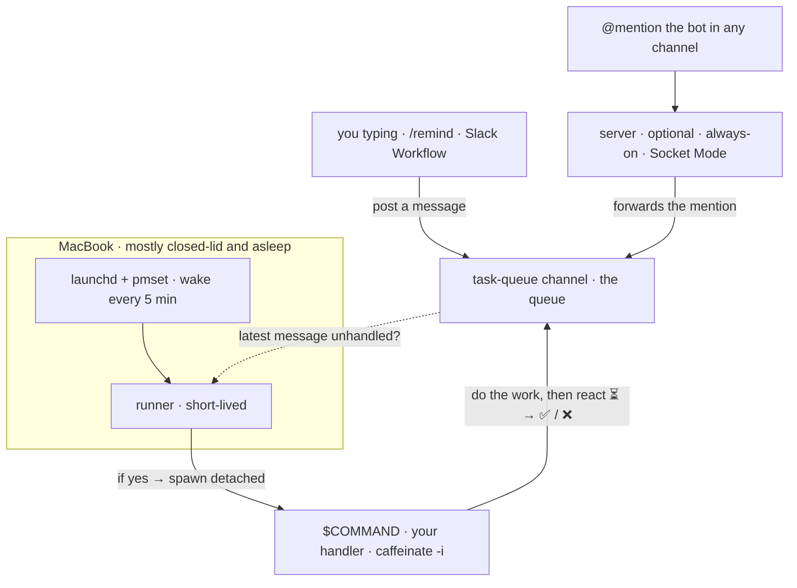

# clamshell-taskq

[English](README.md) · [한국어](README.kr.md)

[](https://github.com/Jin5823/clamshell-taskq/actions/workflows/ci.yml)
[](go.mod)
[](https://goreportcard.com/report/github.com/Jin5823/clamshell-taskq)
[](LICENSE)

**Run background tasks on a MacBook that's mostly closed and asleep.** The laptop wakes itself every 5 minutes, picks up pending work from a Slack channel, runs your command, and goes back to sleep.

("Clamshell" is Apple's term for "laptop with the lid closed" — the mode this tool is built around.)

The Slack channel itself is the queue, and **anything that can post to it enqueues work** — you typing a message, a `/remind`, a Slack Workflow, or the optional `server`. Reactions (`⏳`/`✅`/`❌`) are the state. No database; the runner only ever reads the channel.

- **`runner`** (required, on your laptop) — invoked every 5 minutes by `launchd` + `pmset` wake. If the latest task-channel message carries no `⏳`/`✅`/`❌` reaction yet, it spawns `$COMMAND` detached and exits.
- **`server`** (optional, on any always-on host) — forwards a Slack @mention from any channel into the task channel, so work lands the instant you @mention the bot. Skip it entirely if scheduled posts (`/remind`, Workflow) are all you need.



---

## Build

```bash
go build -o bin/server ./cmd/server
go build -o bin/runner ./cmd/runner
```

Cross-compile (Go does this with env vars only — no toolchain install needed):

```bash
# server
GOOS=linux   GOARCH=amd64 go build -o bin/server-linux-amd64       ./cmd/server
GOOS=linux   GOARCH=arm64 go build -o bin/server-linux-arm64       ./cmd/server
GOOS=darwin  GOARCH=arm64 go build -o bin/server-darwin-arm64      ./cmd/server
GOOS=windows GOARCH=amd64 go build -o bin/server-windows-amd64.exe ./cmd/server

# runner (Unix-like only — relies on POSIX session APIs)
GOOS=darwin GOARCH=arm64 go build -o bin/runner-darwin-arm64 ./cmd/runner
GOOS=linux  GOARCH=amd64 go build -o bin/runner-linux-amd64  ./cmd/runner
```

---

## Slack app

At https://api.slack.com/apps:

1. **Create New App** → from scratch.
2. **Socket Mode** → enable.
3. **App-Level Tokens** → create one with scope `connections:write` → `SLACK_APP_TOKEN` (`xapp-...`).
4. **OAuth & Permissions → Bot Token Scopes**:
   - `app_mentions:read`
   - `chat:write`
   - `reactions:write`
   - `channels:history`

   *Who uses what:* `app_mentions:read` + `chat:write` → the server; `channels:history` → the runner; `reactions:write` (+ `chat:write` for thread replies) → your `$COMMAND` handler. If your queue channel is **private**, use `groups:history` instead of `channels:history`.
5. **Install to Workspace** → copy Bot Token → `SLACK_BOT_TOKEN` (`xoxb-...`).
6. **Event Subscriptions** → subscribe to `app_mention`.
7. Create a channel that will act as the queue (e.g. `#task-queue`). Copy its ID → `SLACK_TASK_CHANNEL` (`C0123...`).
8. Invite the bot into the task channel **and** any channel you want to trigger it from:

   ```
   /invite @your-bot-name
   ```

---

## Server (optional)

The server does one job: the moment you @mention the bot in any channel, it forwards that message into the task channel. That's the **reactive** path — hand off work on the spot, no schedule. It's entirely optional; if `/remind` and Slack Workflows cover you, skip it, since the runner only ever reads the channel.

It's a tiny always-on process, so a cheap VPS or a free-tier host is plenty. (A serverless version may come later.)

Drop the binary on any always-on host with env vars loaded:

```bash
cp .env.example .env
# fill in SLACK_BOT_TOKEN, SLACK_APP_TOKEN, SLACK_TASK_CHANNEL

set -a; source .env; set +a
./bin/server
```

Socket Mode keeps an outbound WebSocket open, so no inbound port or public URL is needed.

---

## Runner (macOS)

> Linux / Windows: coming soon.

### 1. Install the binary

```bash
sudo install -m 0755 bin/runner /usr/local/bin/clamshell-runner
```

### 2. Install the sudoers rule

```bash
./scripts/setup-sudoers.sh
```

Prompts for your sudo password **once**, then installs `/etc/sudoers.d/clamshell-pmset` allowing `pmset schedule wake *` without a password. All other `pmset` subcommands still require a password.

### 3. Prepare runner files (not yet active)

```bash
./scripts/setup-launchd-ready.sh
```

Creates `~/.clamshell-taskq/`, writes the `run.sh` wrapper and the LaunchAgent plist (after checking that the runner binary is installed and the sudoers rule works). It does **not** write `.env` — you copy that in yourself in the next step. **The schedule is not active yet.**

### 4. Copy your `.env` into place

Write a `.env` in the repo (see [`.env.example`](.env.example) for the format), then copy it into the runner's directory:

```bash
cp .env ~/.clamshell-taskq/.env
chmod 600 ~/.clamshell-taskq/.env
```

The file must define:

```
SLACK_BOT_TOKEN=xoxb-...
SLACK_TASK_CHANNEL=C0123456789
COMMAND="/usr/bin/caffeinate -i /usr/local/bin/python3 /Users/me/handlers/main.py"
```

### 5. Activate the schedule

```bash
./scripts/setup-launchd-start.sh
```

Loads the LaunchAgent. The plist has `RunAtLoad=true`, so launchd fires the runner immediately, which kicks off the wake chain (each `run.sh` invocation registers the next wake before exiting). From this point the runner repeats every 5 minutes.

Under the hood, `run.sh` wraps each cycle in `caffeinate -i` and arms several `pmset` wakes bracketing the next 5-minute mark (roughly -10s to +10s around it), so a short, unstable dark wake is less likely to drop the chain.

### What gets installed where

| Path | Owned by | Purpose |
|---|---|---|
| `/etc/sudoers.d/clamshell-pmset` | `setup-sudoers.sh` | `NOPASSWD` for `pmset schedule wake *` only |
| `~/.clamshell-taskq/.env` | you (step 4, `cp`) | your tokens + `$COMMAND` |
| `~/.clamshell-taskq/run.sh` | `setup-launchd-ready.sh` | wrapper: `caffeinate` the cycle → load env → run runner → re-arm the next wake(s) |
| `~/Library/LaunchAgents/com.clamshell-taskq.runner.plist` | `setup-launchd-ready.sh` | `RunAtLoad` + `StartCalendarInterval` at `:00, :05, …, :55` |
| `~/.clamshell-taskq/launchd.{out,err}.log` | launchd | launchd-captured runner output |

### Verify

```bash
pmset -g sched                                 # next wake scheduled?
launchctl list | grep clamshell-taskq.runner   # LaunchAgent registered?
tail -f ~/.clamshell-taskq/launchd.{out,err}.log
```

### Uninstall

```bash
launchctl unload ~/Library/LaunchAgents/com.clamshell-taskq.runner.plist
rm ~/Library/LaunchAgents/com.clamshell-taskq.runner.plist
sudo rm /etc/sudoers.d/clamshell-pmset
sudo rm /usr/local/bin/clamshell-runner
sudo pmset schedule cancelall
# rm -rf ~/.clamshell-taskq                    # also wipes env/logs
```

---

## Enqueuing tasks

A "task" is just a message in the task channel, so **anything that can post there enqueues work** — and the next runner cycle picks up any unhandled message and fires `$COMMAND`. That channel is the entire interface; nothing is special about who posts or how.

Two flavors, depending on the work:

- **Scheduled / recurring — nothing always-on of your own to run.** Let Slack itself post into the task channel on a timer (table below). This is the common case.
- **Reactive / instant — the optional [`server`](#server-optional).** @mention the bot in any channel and it forwards the message into the task channel right away. Use it only when you want that immediacy.

### Scheduling recurring tasks

Slack already knows how to post messages on a schedule — let it be your cron. Pick the tool that matches the cadence you need:

| Cadence | Tool | How |
|---|---|---|
| Daily / weekly, at a set time | `/remind` | Run `/remind` **in the task channel** and it lands straight in the queue — e.g. `/remind here to "run the daily check" every day at 9am`. (Run it elsewhere with an `@your-bot` mention and the optional server forwards it instead.) |
| Down to the hour | **Slack Workflow** | `/remind` can't recur more often than daily. Build a Workflow (Workflow Builder → *Scheduled* trigger) whose step posts the task message into the task channel. |
| Down to the minute | **Your own server / cron** | Slack's built-in schedulers don't go that fine. Run a small always-on job that posts into the task channel on a minute-level cron. |

> The runner wakes every 5 minutes, so that's the floor for *processing*: minute-level enqueues just pile up and get cleared on the next wake (the handler drains every pending message each run).

**Workflows aren't just for schedules.** A Slack Workflow can also fire on an *event* — a specific message appearing in some channel, an emoji reaction, a form submission — and post into the task channel in response. That's reactive enqueuing with no server of your own to run.

---

## `$COMMAND` contract

The runner fires once on the latest unhandled message; **your command owns the whole loop.** Reactions in the channel are the only state, and the runner can fire again at any time — so write the handler to be **safe to re-run**: idempotent and crash-safe. The proven shape has three phases:

1. **Collect pending — newest to oldest, stop at the first handled message.** Page back through `conversations.history`. A message is *handled* if it already carries any of `⏳` / `✅` / `❌`; the moment you hit one, everything older is done too (FIFO) — stop. Skip system messages (those with a `subtype`).
2. **Claim everything with `⏳` first.** Before doing any work, add `⏳` (`hourglass_flowing_sand`) to every collected message. Now the next runner cycle sees them as handled and won't double-grab them.
3. **Process oldest first, and remove `⏳` last.** For each: do the work, post the result in-thread, add the terminal reaction (`✅` `white_check_mark` on success, `❌` `x` on failure), **then** remove `⏳`. Always reach a terminal reaction — catch your errors and mark `❌` rather than letting a message fall through.

Two rules make it crash-safe:

- **Remove `⏳` last.** If the process dies right after the terminal reaction or just before removing `⏳`, the message still shows a handled reaction (`⏳`, or `✅`/`❌`), so the next cycle skips it — no duplicate work or replies. A brief `⏳`+`✅` overlap is normal.
- **Make every Slack call idempotent.** A re-run touches the same message again, so swallow the "already done" errors: `already_reacted` when adding, `no_reaction` / `message_not_found` when removing, `cannot_reply_to_message` / `thread_not_found` when replying.

Sketch (Python, `slack_sdk`):

```python
RUNNING, DONE, FAILED = "hourglass_flowing_sand", "white_check_mark", "x"
HANDLED = {RUNNING, DONE, FAILED}

pending = collect_pending(client, channel)   # newest→oldest, stop at first HANDLED, skip subtypes
for msg in pending:                          # claim all up front
    add_reaction(client, channel, msg["ts"], RUNNING)

for msg in reversed(pending):                # oldest first
    ts = msg["ts"]
    try:
        do_work(msg)
    except Exception as e:
        post_thread(client, channel, ts, f"failed: {e}")
        add_reaction(client, channel, ts, FAILED)
        remove_reaction(client, channel, ts, RUNNING)   # ⏳ comes off last
        continue
    post_thread(client, channel, ts, "done")
    add_reaction(client, channel, ts, DONE)
    remove_reaction(client, channel, ts, RUNNING)        # ⏳ comes off last
```

`add_reaction` / `remove_reaction` / `post_thread` here are thin wrappers that ignore the "already done" errors above, so a re-run never crashes on a message it already touched.

`launchd` does not inherit your shell PATH, so use absolute paths for the interpreter and the script. **Wrap the command with `caffeinate -i`** — after a `pmset` wake the Mac is in dark wake with a short idle timer (often under a minute), so without `caffeinate` a long-running command can get cut off when macOS idles back to sleep mid-task.

```
COMMAND="/usr/bin/caffeinate -i /usr/local/bin/python3 /Users/me/handlers/main.py"
```

### Output

| What | Where |
|---|---|
| `launchd`-captured runner output | `~/.clamshell-taskq/launchd.{out,err}.log` |
| Your `$COMMAND`'s stdout/stderr | `~/.clamshell-taskq/logs/<timestamp>.log` |

---

## Honest limits

- **macOS itself does not guarantee** every scheduled wake fires under every combination of conditions — lid closed, on battery, deep sleep. There are scattered reports of firmware sleep hangs on M-series Macs running macOS 26.x. Expect **most** 5-minute cycles to fire when closed and asleep; a missed cycle just means the work waits for the next one.
- Missed wakes are not lost work: the Slack channel is the queue, so the next cycle catches up on whatever piled up.

## License

MIT — see [LICENSE](LICENSE).
